<picture>
  <source media="(prefers-color-scheme: dark)" srcset="assets/terminal-dark.svg">
  
</picture>

 &nbsp;<i>say hi</i> → <a href="mailto:abhihalder343@gmail.com"><b>abhihalder343@gmail.com</b></a> &nbsp;·&nbsp; replies ship with <b>proof</b>.
